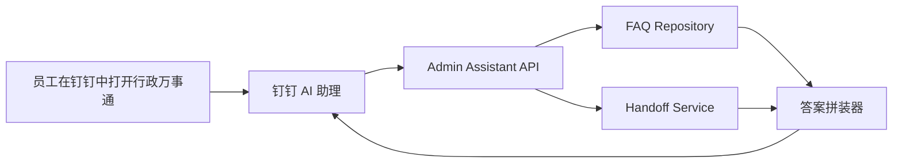

# 🏗️ 钉钉行政万事通技术架构设计

> 本文档聚焦“独立新项目”的一期技术架构。  
> 当前判断是：**RAG 后续通过接口接入**，因此一期先建设一个可运行的问答骨架，而不是一次性建设完整重型检索平台。

---

## 📑 目录

- [📌 文档目标](#-文档目标)
- [🎯 一期建设目标](#-一期建设目标)
- [🧭 当前最需要做什么](#-当前最需要做什么)
- [🧱 系统职责划分](#-系统职责划分)
- [🔄 一期交互链路](#-一期交互链路)
- [⚖️ 一期与后续 RAG 的分层关系](#️-一期与后续-rag-的分层关系)
- [🛠️ 推荐技术栈](#️-推荐技术栈)
- [📦 一期最小模块清单](#-一期最小模块清单)
- [🚀 实施顺序建议](#-实施顺序建议)
- [✅ 结论](#-结论)

---

## 📌 文档目标

这份文档主要回答两个问题：

1. 现在这个阶段，项目到底应该先做什么  
2. 既然 RAG 后续通过接口接入，那一期自己的系统边界应该怎么定  

---

## 🎯 一期建设目标

一期不是先做“最强智能问答”，而是先做一个**钉钉内可访问、可提问、可回复、可转人工**的行政助理 MVP。

### 一期目标拆解

| 目标 | 说明 |
| --- | --- |
| 助理入口 | 在钉钉中拥有组织内 AI 助理入口 |
| 助理形态 | 有欢迎语、快捷问题、输入区、回复区 |
| 问答骨架 | 能处理行政 FAQ 问题 |
| 内容骨架 | 有结构化 FAQ 数据模型 |
| 边界控制 | 回答不确定时能转人工 |
| 扩展能力 | 预留后续 RAG Provider 接口 |

---

## 🧭 当前最需要做什么

如果把事情按优先级排，现在最该做的不是“先上 RAG”，而是先做下面这 5 件事：

### 1. 先把助理骨架搭出来

包括：

- 助理名称
- 欢迎语
- 快捷问题
- 用户提问入口
- 标准回复格式

### 2. 先把行政知识结构定下来

不是先堆原始文档，而是先整理：

- 标准问题
- 相似问法
- 标准答案
- 步骤
- 例外情况
- 转人工条件

### 3. 先把问答服务边界写清楚

问答服务一期主要做：

- 接收钉钉消息
- 查询 FAQ
- 拼装回复
- 判断是否转人工

### 4. 预留 RAG 接口层

一期先不要把系统写死成“只能查本地 FAQ”。  
应该从一开始就留出 `RagProvider` 或 `KnowledgeRetriever` 抽象层，未来直接改为调外部接口。

### 5. 先把上线前置条件准备好

- 钉钉管理员权限
- AI 助理创建权限
- 可访问回调地址
- 行政内容负责人
- 首批 FAQ 内容

---

## 🧱 系统职责划分

| 模块 | 负责什么 | 一期是否必须 |
| --- | --- | --- |
| 钉钉 AI 助理 | 入口、会话、消息展示 | 是 |
| Admin Assistant API | 接钉钉回调、返回答案 | 是 |
| FAQ Repository | 查询结构化行政知识 | 是 |
| Handoff Service | 判断何时转人工 | 是 |
| RAG Provider | 调外部检索接口 | 预留，不强制一期落地 |
| Admin CMS | 维护后台 | 否，可后补 |

---

## 🔄 一期交互链路



### 一期回答逻辑

```text
优先查 FAQ
  -> 命中且足够明确：直接返回标准答案
  -> 命中但边界模糊：返回答案 + 补充转人工提示
  -> 未命中：返回“暂未收录/请联系谁”
```

---

## ⚖️ 一期与后续 RAG 的分层关系

### 推荐分层方式

| 层级 | 一期做法 | 后续增强 |
| --- | --- | --- |
| 问题接入 | 钉钉回调进入后端 | 不变 |
| 知识召回 | FAQ / 标签 / 相似问法匹配 | 接外部 RAG 检索接口 |
| 答案生成 | 模板化回答或轻模型整理 | 结合检索结果生成更自然回答 |
| 边界控制 | 固定规则 + 人工转接 | 加入置信度和重排策略 |

### 推荐接口抽象

```ts
export type KnowledgeHit = {
  id: string;
  question: string;
  answer: string;
  score: number;
  source: "faq" | "rag";
};

export interface KnowledgeRetriever {
  search(query: string): Promise<KnowledgeHit[]>;
}
```

### 当前建议

一期先实现：

- `FaqKnowledgeRetriever`

后续再接：

- `ExternalRagKnowledgeRetriever`

这样项目可以先跑起来，之后只替换检索实现，不用重做整条链路。

---

## 🛠️ 推荐技术栈

### 一期推荐

| 模块 | 推荐技术 |
| --- | --- |
| 后端运行时 | Node.js |
| 语言 | TypeScript |
| Web 框架 | Next.js App Router + API Routes |
| 数据库 | PostgreSQL |
| ORM | Prisma |
| 配置管理 | dotenv |
| 对接钉钉 | DingTalk AI 助理直通模式 / Stream Mode |
| LLM 接口 | OpenAI Compatible API |

### 为什么这么选

- 起步快，适合 MVP
- 接 HTTP 接口、WebHook、RAG 外部服务都顺手
- 先聚焦机器人后端与调试能力，项目边界更清晰
- 后续如果需要补管理端，再单独评估是否拆新入口

---

## 📦 一期最小模块清单

### 必须有

- `apps/server`
- `src/app`
- `docs/superpowers/specs`
- `docs/superpowers/plans`
- `src/modules/assistant`
- `src/modules/knowledge`
- `src/modules/handoff`
- `src/modules/dingtalk`
- `src/config`

### 一期建议文件边界

| 文件/目录 | 作用 |
| --- | --- |
| `src/app/api/dingtalk/webhook/route.ts` | 接钉钉消息 |
| `src/modules/assistant/assistant.service.ts` | 调度问答流程 |
| `src/modules/knowledge/faq-retriever.ts` | FAQ 检索 |
| `src/modules/knowledge/retriever.types.ts` | 检索接口定义 |
| `src/modules/handoff/handoff.service.ts` | 转人工规则 |
| `src/modules/assistant/reply-builder.ts` | 拼装最终回复 |

---

## 🚀 实施顺序建议

### 第一阶段：先把基础框架立住

- 创建独立项目目录
- 初始化 Next.js + TypeScript
- 写 README、架构说明、实施计划
- 定义模块边界

### 第二阶段：先让助理能接消息并回固定内容

- 完成钉钉接入
- 完成欢迎语和快捷问题配置
- 完成基础回调接口
- 先返回固定测试消息

### 第三阶段：把 FAQ 接进来

- 建立 FAQ 数据结构
- 建立 FAQ 查询逻辑
- 返回标准答案
- 增加转人工判断

### 第四阶段：为 RAG 接口预留扩展点

- 抽象 `KnowledgeRetriever`
- 默认实现 FAQ 检索
- 增加外部 RAG 检索 Provider 占位

---

## ✅ 结论

既然你们已经确认：

> **RAG 后续通过接口接入**

那么现在项目真正该做的是：

1. 先把钉钉行政助理的产品骨架搭起来  
2. 先把结构化 FAQ 问答链路做出来  
3. 先把转人工边界写清楚  
4. 从一开始就把 RAG 设计成“可插拔外部能力”  

这会比一开始就做重型检索系统更稳，也更适合一期 MVP。
